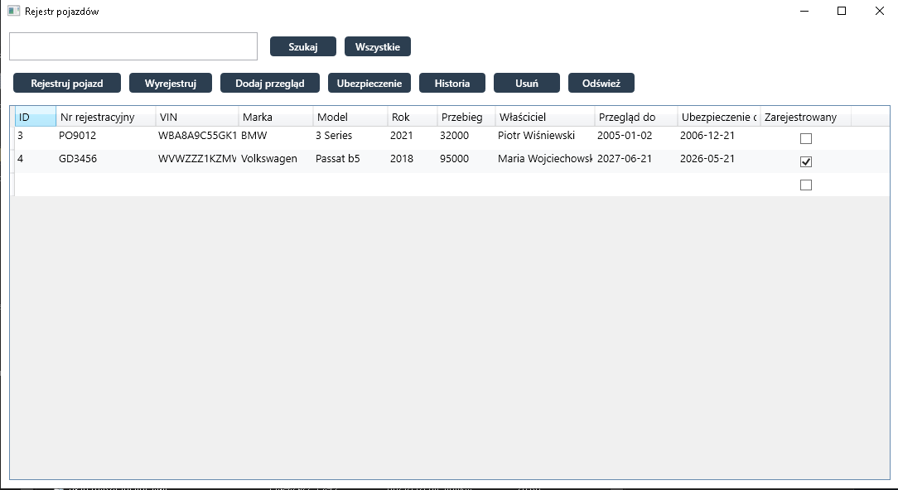

# Vehicle Registry

A WPF desktop application using MVVM and EF Core for managing a vehicle registry.

## Features

- Full CRUD for vehicles
- Management of inspections and insurances
- Vehicle change history
- Search across all columns
- Automatic saving of edits in DataGrid
- Data validation

## Screenshots

*Place a screenshot of the main application window here (e.g., screenshot.png in the repository root).*

## Technologies

- C# / .NET 8
- WPF + XAML
- MVVM
- Entity Framework Core + SQLite
- LINQ

## How to Run

Open the solution in Visual Studio, compile, and run. The SQLite database will be created automatically.

## Structure

- Models – domain classes and business logic
- ViewModels – ViewModels and commands
- Views – XAML windows
- Styles – global styles

## License

This project is licensed under the MIT License – see the [LICENSE](LICENSE) file for details.